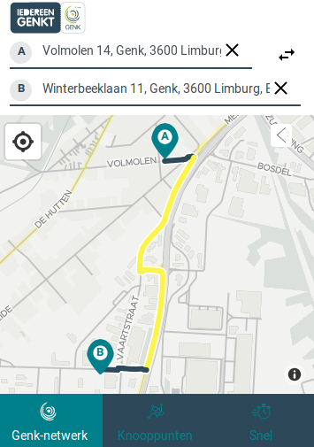
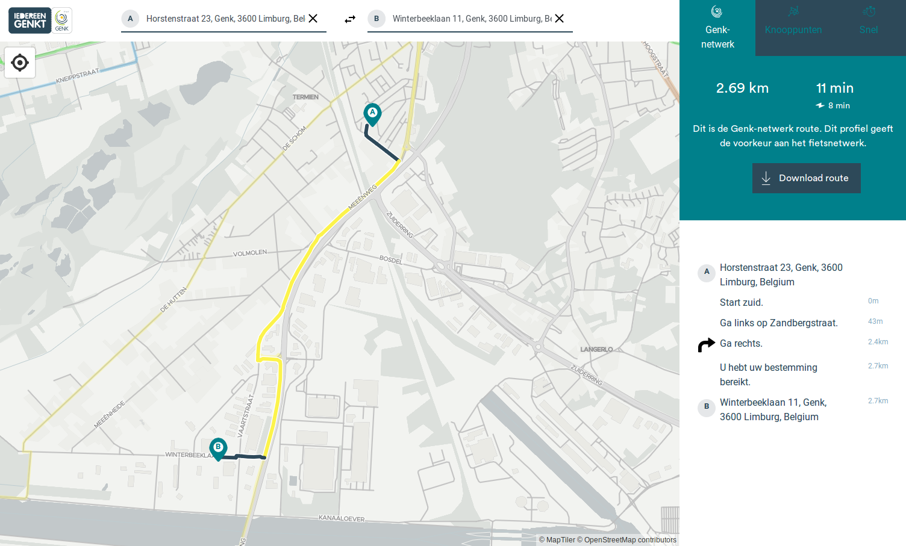

# Genk Route Planner

This repository is a fork of the 'Bike4Brussels' route planner which was an Open Summer Of Code 2018 project.

The website is hosted here:

- production: https://routing.anyways.eu/projects/genk/
- staging: https://routing.anyways.eu/projects/genk/staging/

This uses our main routing API: https://docs.anyways.eu/routing-api/

  

